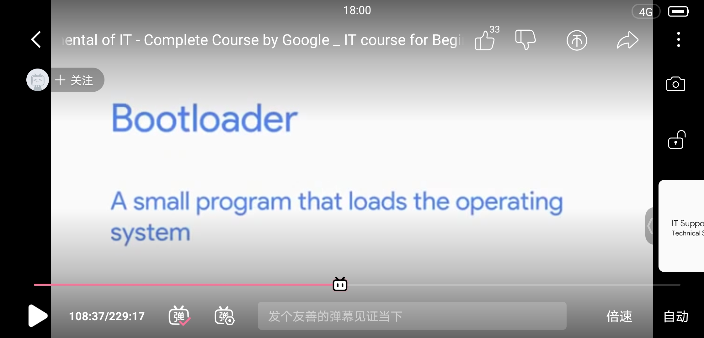

 
    
Homework One

41903178 邢砚薷

**`截图举例`**

- bootloader，即启动加载程序，是嵌入式操作系统内核运行之前运行的第一段代码，可以初始化CPU与相关硬件，为最终调用操作系统内核准备好正确的环境。

# **Introduction to IT**
## 1.1. Introduction
- IT (information technology)--The use of digital technology, like computers and the Internet, to store and process data into useful information
- IT Support Specialist—varying, ensure daily equipment, best the system—managing, installing, maintaining, trouble solving…
## 1.2. History of Computing
- from abacus to analytical engine
- computer—a device that stores and processes data by performing calculations
## 1.3. Digital Logic
- algorithm—a series of steps that solve specific problems
- cryptography—the art of writing and solving codes
- open source—for all to modify and share
- computer language
- binary system—the communication a computer uses, also known as a base-2 numeral system (2^8)
- bit-a binary digit
- character encoding—assigns our binary values to characters, so that we as human can read them
- logic gates—allow our transistors to do more complex tasks, like decide where to send electrical signals - - - depending on logical conditions
- decimal form--base-10 numeral system
## 1.4. Computer Architecture Layer
- abstraction—to take a relatively complex system and simplify it for our use
- Four layers:
  - Hardware layer-Made up of the physical components of a computer; 
  - Operating system-Allows hardware to communicate with the system;
  - Software layer-How we as humans interact with our computer; 
  - User-Interacts with the computer

# **Hardware**
## 2.1. Components
### 2.1.1. Storage
- hard drive
- HDD(hard disk)—RPM(revolution per minute)-more affordable
- SSD(Solid state drive)—data travels faster than HDD, less fragile
- ATA-Serial ATA(SATA)
- NVMe—NVM express
### 2.1.2. Power supplies
- voltage(volt)—must be suitable
- amperage(amp)
- Wattage-- amount of volts and amps that a device needs
### 2.1.3. Peripherals
- Peripherals--Anything that you connect to your computer externally that adds functionality
  - USB(Universal Serial Bus)--
  - USB 2.0-Transfer speeds of 480 Mb/s
  - USB 3.0-Transfer speeds of 5Gb/s
  - USB 3.1-Transfer speeds of 10 Gb/s
- MB is megabyte or unit of data storage, while Mb/s is a megabit per second, which is a unit of data transfer rate.
- Remember that 1 byte is 8 bits, so to transfer a 1MB file in a second, you need an 8 Mb/s connection speed.
- Type-C Connector
- DVI-video
- HDMI-video & audio
- DisplayPort
## 2.2. Modern Computer
### 2.2.1. Introduction
- CPU(Central Processing Unit)--The brain of our computer, does all the calculations and data processing
- RAM(Random Access Memory)--Our computer's short-term memory
- Hard drive--Holds all of our data, which includes all of our music, pictures, applications
- Motherboard--The body or circulatory system of the computer that connects all the pieces together
### 2.2.2. Program and hardware
- Programs--Instructions that tell the computer what to do
- EDB(External Data Bus)
- Registers
- MCC(Memory Controller Chip)
- Cache—3 levels:L1-smallest and fastest
- Clock Wires; clock cycle; clock speed--The maximum number of clock cycles that can handle in a certain time period
  - 3.40 gigahertz = 3.4 billion cycles per second.
- overclocking
### 2.2.3. CPU
- When you select your CPU, you'll need to make sure it's compatible with your
- motherboard--the circuit board that connects all your components together.
- Land grid array(LGA) & Pin grid array(PGA)
- heat sink
### 2.2.4. RAM
- There are many types of RAM, and the one that's commonly found in computers is DRAM or dynamic random-access memory.
- There are also different types of memory sticks that DRAM chips can be put on. The more modern DIMM sticks, which usually stands for Dual Inline Memory Module, have different sizes of pins on them.
- In today’s system, we use another type of RAM, called double data rate SDRAM or DDR SDRAM for short.
- SDRAM—Synchronous DRAM
### 2.2.5.Motherboard
- Chipset— Northbridge & Southbridge
- Peripherals--External devices we connect to our computer, like a mouse, keyboard, and monitor
- Expansion slots--Give us the ability to increase the functionality of our computer
- PCI Express-- Peripheral Component Interconnect Express
- ATEX—Advanced Technology eXtended
- ITEX—Information Technology eXtended
## 2.3.Starting It Up

# **Operating System**
## 3.1. Definition
### 3.1.1. Components
- Operating system--The whole package that manages our computer's resources and lets us interact with it
- User Space—applications
- Kernel Space—process manager, memory manager, file manager, I/O manager
- file system—major one is NTFS-
- ReFS
- I/O Management--Anything that can give us input, or that we can use for output of data
- Encryption; Faster access speeds; Security
- Block storage--Improves faster handling of data because the data isn't stored as one long piece and can be accessed quicker
- File extension--The appended part of a filename that tells us what type of file it is in certain operating systems
### 3.1.2. Process management
- Process--A program that's executing, like our internet browser or text editor
- Time slice--A very short interval of time that gets allocated to a process for CPU execution
- Kernel--Creates processes, efficiently schedules them, and manages how processes are terminated
### 3.1.3. Memory management
- Virtual memory--The combination of hard drive space and RAM that acts like memory that our processes can use
### 3.1.4. I/O management
- I/O devices--Devices that perform input and output
- When you're troubleshooting or solving a problem with a slow machine, it's usually some sort of hardware resource deficiency
### 3.1.5. User space
- to interact with the operating system—shell/GUI
  - Shell--A program that interprets text commands and sends them to the OS to execute
  - graphical user interface--GUI
- Bourne Again Shell(BASH)
### 3.1.6. Logs
- Logs--Files that record system events on our computer, just like a system's diary
### 3.1.7. the Boot process
- BIOS/UEFI--A low-level software that initializes our computer's hardware to make sure everything is good to go
- Bootloader--A small program that loads the operating system
## 3.2. Installing an Operating System
### 3.2.1. Choose an operate system
- already made?--The operating systems in use by an organization have a lot to do with the applications and systems that they need to run.
- what software to run?--Modern operating systems do a pretty good job of supporting common hardware.
- CPU--64-bits / 32-bits?
- As a Support Specialist, you'll install an operating system many times, so using one single disk won't be time efficient or scalable.
### 3.2.2. Virtual machines
- Virtual Machine (VM)—a copy of physical machines
### 3.2.3. Installing Windows
### 3.2.4. Installing LINUX

# **Networking**
## 4.1. What is networking?
### 4.1.1. Definition
- The Internet--The physical connection of computers and wires around the world
- The Web--The information on the Internet
- servers & clients
- ISP—Internet Service Provider
- Computers on a network have an identifer called an IP address.
- MAC address
- When you send or receive data through a network you need to have both an IP and a MAC address.
### 4.1.2. Networking Hardware
- Router--Connects lots of different devices together and helps route network traffic
- Switches and Hubs
- Network stack--A set of hardware or software that provides the infrastructure for a computer
### 4.1.3. Language of the Internet
- IP(Internet Protocol)—delivers packets to right computers
- TCP(Transmission Control Protocol)—deliver information from one computer to another
### 4.1.4. the Web
- URL—Uniform Resource Locator
- Domain Name System
- ICANN—Internet Corporation for Assigned Names and Numbers
## 4.2. Limitations of the Internet
### 4.2.1. History
### 4.2.2. Limitations
- IPV4 & IPV6
## 4.3. Impacts of the Internet
### 4.3.1. Fields changed
- Network Address Translation(NAT)-- Lets organizations use one public IP address and many private IP addresses within the network
- Globalization--The movement that lets governments, businesses, and organizations communicate and integrate together on an international scale
- Entertainment
- Retail—Education
### 4.3.2.Internet of Things(IoT)
- smart household devices
### 4.3.3.Privacy and Security
- individual & governmental
- cyber attack

# **Software**
## 5.1. Introduction to Software
### 5.1.1. What is software?
- Coding—translating one language to another
- Scripting—coding in a scripting language
- Scripts—mainly used to perform a single or limited range task
- Programming—coding in a programming language
### 5.1.2. Types of software
- Commercial/open source
- Programming languages--Special languages that software developers use to write instructions for computers to execute
- Application software--Any software created to fulfill a specific need, like a text editor, web browser, or graphic editor
- System software--Software used to keep our core system running, like operating system tools and utilities
- Firmware--Software that's permanently stored on a computer component
### 5.1.3.languages
- Assembly language--Allowed computer scientists to use human readable instructions, assembled into code, that the machines could understand
- Compiled programming languages--Uses human readable instructions, then sends them through a compiler
- script—run by an interpreter, which interprets the code into CPU instructions just in time to run them.
## 5.2. Interacting with Software
### 5.2.1. Managing software
- Software bug--An error in software that causes unexpected results
### 5.2.2. Installing, updating, and removing software on Windows
- Git--A version control system that helps keep track of changes made to files and directories
- exe--file extension found in Windows for an executable file

# **Troubleshooting**
## 6.1. Best Practices
### 6.1.1. Introduction
### 6.1.2. Ask questions
- Troubleshooting—the ability to diagnose and solve a problem
### 6.1.3. Isolating the problem
- discovering the cause
### 6.1.4. Follow the cookie crumbs
- error messages
### 6.1.5. Pitfalls to avoid
- go into autopilot
- not finding the root cause
## 6.2. Customer Services
### 6.2.1. Soft skills
- Empathy
- Conscious of your tone
- Acknowledgement
- Develop trust
### 6.2.2. Anatomy of an interaction
- professional & respect
## 6.3. Documentation

**`41903178 邢砚薷`**
